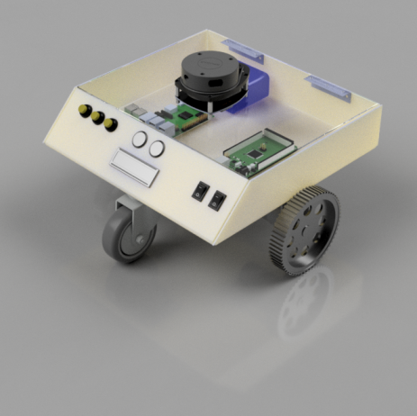

# Project Tango source code repository 

## Description:
An autonomous indoor unmanned ground vehicle made from scratch which initially had inspiration from TurtleBot3 but is now different in terms of electronic components, mechanical build as well as software packages.

***

## Workspaces under this repository:
1. ###  control_ws 
    * general purpose motion planning package
2. ### tango_sim_ws
    * Simulation workspace for Project Tnago in various worlds

***

## Usage:
Use the following command to launch Tango in a maze world with RPLidar sensor.

```roslaunch tango_description display.launch```

## Maintainer : _[carpit680](https://gitlab.com/carpit680)_
